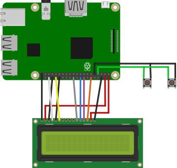

# aipod

## Bill of Material
- [Raspberry Pi 3](https://www.raspberrypi.org/products/)
- [16x2 LCD Display LCM1602C V2.1](http://www.datasheetcafe.com/lcm1602c-datasheet-pdf/)
- [Arcade buttons](https://www.amazon.fr/gp/product/B01N5DVINY)
- [Ampli CALIBER CA752](http://webshop.caliber.nl/products/view/details/ca75-2.html)
- [Speakers FRS 8-8 Ohm](http://www.visaton.de/en/products/fullrange-systems/frs-8-8-ohm)

## Wiring


16x2 LCD Display is connected as follow:
- RS is connected to GPIO16
- EN is connected to GPIO12
- D4 is connected to GPIO25
- D5 is connected to GPIO24
- D6 is connected to GPIO23
- D7 is connected to GPIO18
- (+ 4xGND and 2x5V)

[Buttons](https://www.amazon.fr/gp/product/B01N5DVINY) are connected to GPIO4, configured as input pullup. (+ GND)
___


## Install & run

Download the image [here]() and burn it on an 8GB micro SD using [etcher](https://www.balena.io/etcher/) or start with a fresh install of [Raspbian Stretch with desktop and recommended software]()

**Clone repo**
```bash
cd /home/pi
git clone https://github.com/emlyon/aipod
```

**Install Dependencies**
```bash
sudo apt-get update -y
sudo apt-get upgrade -y
sudo apt-get install python3-pip
sudo pip3 install pygame adafruit-blinka adafruit-circuitpython-charlcd
```
From [Update Your Pi to the Latest Raspbian](https://learn.adafruit.com/drive-a-16x2-lcd-directly-with-a-raspberry-pi?view=all#update-your-pi-to-the-latest-raspbian-3-1)

**Run**
```bash
cd /home/pi/aipod
python3 aipod.py
```
___

## Auto-update and run on boot

**Configure WIFI**
```bash
sudo raspi-config

# Set Wifi settings:
-> 2. Network Options
-> N2 Wi-fi
SSID: makerslab
passphrase: makerslab
```

**Run task on boot**
```bash
crontab -e

# and add:
@reboot sleep 10 && cd /home/pi/aipod && echo `{ git pull && echo '{"result":"up to date"}' > /home/pi/git_status.json ; } || echo '{"result":"could not update"}' > /home/pi/git_status.json` && python3 aipod.py
```

Finally create a hotspot with your phone using `makerslab` for **SSID and password**, and reboot the Raspberry Pi. LCD dislay should print `up to date` if successful, `could not update` otherwise.

## Resources
- [Adafruit-Blinka](https://pypi.org/project/Adafruit-Blinka/)
- [Adafruit CIRCUITPYTHON_CHARLCD Library](https://circuitpython.readthedocs.io/projects/charlcd/en/latest/)
- [pygame.mixer.music](https://www.pygame.org/docs/ref/music.html)
- [Drive a 16x2 LCD with the Raspberry Pi Output Character](https://learn.adafruit.com/drive-a-16x2-lcd-directly-with-a-raspberry-pi?view=all)
